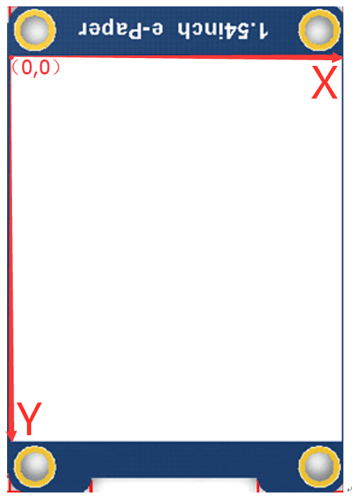

# 2.9" Waveshare e-paper library for Arduino
This is a library for the Waveshare 2.9" e-Paper display. The library allows you to type strings, draw rectangles, and display images directly to the display while handling the nitty-gritty bit-manipulations involved in moving the data into the correct memory address of the buffer. 
When calling printf, showImg, or drawRect, remember to call updateScreen() afterwards to actually implement the changes. 

Please note this library has only been tested with an ESP-32 running Arduino.

The orientation of the screen and its origin are as follow

## Hardware connection (e-Paper --> Arduino)
This configuration can be changed in epdif.cpp
    3.3V/5V --> 3V3
    GND     --> GND
    DIN     --> MO
    CLK     --> SCK
    CS      --> 14
    DC      --> 33
    RST     --> 27
    BUSY    --> 13

#define RST_PIN         27
#define DC_PIN          33
#define CS_PIN          14
#define BUSY_PIN        13

# Interfaces
| Name | Description                                                   |
|------|---------------------------------------------------------------|
| VCC  | 3.3V/5V                                                       |
| GND  | GND                                                           |
| DIN  | SPI MOSI                                                      |
| CLK  | SPI SCK                                                       |
| CS   | SPI chip select (Low active)                                  |
| DC   | Data/Command control pin (High for data, and low for command) |
| RST  | External reset pin (Low for reset)                            |
| BUSY | Busy state output pin (Low for busy)                          |

